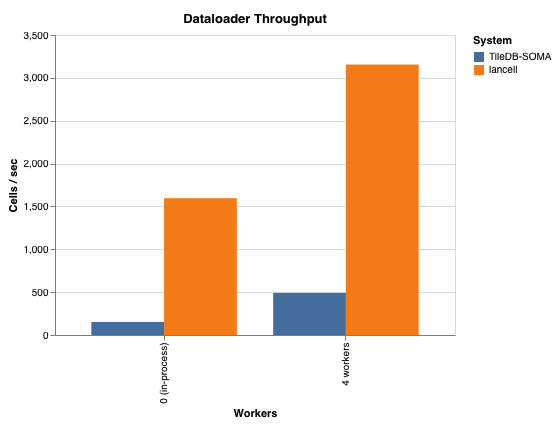
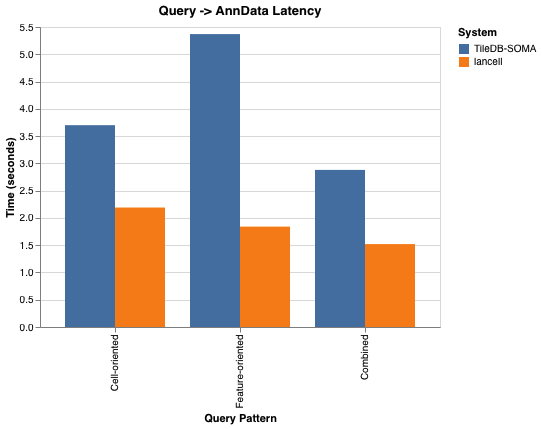

# lancell

Multimodal single-cell database built on [LanceDB](https://lancedb.com) and [Zarr](https://zarr.dev). Designed for building heterogeneous cell atlases and training foundation models on them.

Cell metadata lives in LanceDB — queryable with SQL predicates, vector search, and full-text search. Raw array data (count matrices, embeddings, images) lives in sharded Zarr. A PyTorch-native data loading layer reads directly from those stores without intermediate copies or format conversions.

- **[Documentation](https://epiblastai.github.io/lancell/)**

---

## Installation

Prebuilt wheels are available on PyPI. Requires Python 3.13.

```bash
pip install lancell          # core: atlas, querying, ingestion
pip install lancell[ml]      # + PyTorch dataloader
pip install lancell[bio]     # + scanpy, bionty, GEOparse
pip install lancell[io]      # + S3/GCS/Azure, image codecs
pip install lancell[viz]     # + marimo, matplotlib
pip install lancell[all]     # everything
```

To build from source (requires a Rust toolchain):

```bash
curl -LsSf https://astral.sh/uv/install.sh | sh
curl --proto '=https' --tlsv1.2 -sSf https://sh.rustup.rs | sh
uv sync
maturin develop --release
```

---

## The RaggedAtlas

Real-world atlas building involves datasets that were not designed to be compatible — different gene panels, different assay types, different obs schemas. Conventional tools handle this by padding to a union matrix (wasteful) or intersecting to shared features (lossy).

Lancell's `RaggedAtlas` takes a different approach: each dataset occupies its own Zarr group with its own feature ordering. Every cell carries a pointer into its group. The reconstruction layer handles union/intersection/feature-filter logic at query time — no padding is stored, no information is discarded at ingest.

```
Cell table (shared)                Zarr (per-dataset)
──────────────────                 ──────────────────
cell A  gene_expression → pbmc3k/  pbmc3k/   1838 genes, 2638 cells
cell B  gene_expression → pbmc3k/  pbmc68k/   765 genes,  700 cells
cell C  gene_expression → pbmc68k/
```

At query time, the reconstruction layer joins the feature spaces: it computes the union or intersection of global feature indices, scatters each group's data into the right columns, and returns a single AnnData with every cell correctly placed.

### Quickstart

```python
import obstore.store
from lancell.atlas import RaggedAtlas
from lancell.schema import LancellBaseSchema, FeatureBaseSchema, SparseZarrPointer
from lancell.ingestion import add_from_anndata

class GeneFeature(FeatureBaseSchema):
    gene_symbol: str

class CellSchema(LancellBaseSchema):
    cell_type: str | None = None
    gene_expression: SparseZarrPointer | None = None

store = obstore.store.LocalStore("/data/atlas/arrays")
atlas = RaggedAtlas.create(
    db_uri="/data/atlas/db",
    cell_table_name="cells",
    cell_schema=CellSchema,
    store=store,
    registry_schemas={"gene_expression": GeneFeature},
)

atlas.register_features("gene_expression", features)
add_from_anndata(atlas, adata, feature_space="gene_expression",
                 zarr_layer="counts", dataset_record=record)
atlas.optimize()
atlas.snapshot()

atlas_r = RaggedAtlas.checkout_latest("/data/atlas/db", CellSchema, store)
adata = atlas_r.query().where("cell_type = 'T cells'").to_anndata()
```

### Querying

The cell table is a LanceDB table — the full query surface is available without custom loaders.

```python
# SQL filter
adata = atlas_r.query().where("tissue = 'lung' AND cell_type IS NOT NULL").to_anndata()

# Vector similarity search
hits = atlas_r.query().search(query_vec, vector_column_name="embedding").limit(50).to_anndata()

# Feature-filtered query — reads only the byte ranges for those genes (CSC index)
adata = atlas_r.query().features(["CD3D", "CD19", "MS4A1"], "gene_expression").to_anndata()

# Intersection across ragged datasets (only genes shared by all)
shared = atlas_r.query().feature_join("intersection").to_anndata()

# Count by cell type — cheap, only fetches the grouping column
atlas_r.query().count(group_by="cell_type")
```

For large results, `.to_batches()` provides a streaming iterator that avoids materialising everything at once. `.to_mudata()` returns one AnnData per modality for multimodal atlases.

The `notebooks/` directory contains [marimo](https://marimo.io) notebooks covering end-to-end atlas construction from scBaseCount data and the TileDB-SOMA benchmark used in the Performance section below.

---

## Performance

Benchmarked against TileDB-SOMA on a ~44M cell mouse atlas (CellxGene Census), reading from S3.

### ML dataloader throughput

`CellDataset` is a map-style PyTorch dataset in contrast to the TileDB iterable-style dataset. This allows it to leverage PyTorch's `DataLoader` for parallelism and locality-aware batching. Lancell's dataloader achieves an order of magnitude higher throughput than TileDB-SOMA on a single worker even with fully random data shuffling.



| Workers | TileDB-SOMA | lancell | Speedup |
|---------|-------------|---------|---------|
| 0 (in-process) | ~150 cells/s | ~1,600 cells/s | ~10x |
| 4 workers | ~500 cells/s | ~3,150 cells/s | ~6x |

### Query → AnnData latency

Three access patterns: cell-oriented (filter by cell type, full matrix), feature-oriented (subset genes across a population), and combined.



Lancell is 1.7–3x faster across patterns, with the largest margin on feature-oriented queries where the CSC index avoids scanning irrelevant cells entirely.

### Fast cloud reads: RustShardReader

Zarr's sharded format packs many chunks into a single object-store file, with an index recording each chunk's byte offset. The Python zarr stack issues one HTTP request per chunk even when chunks could be coalesced.

Lancell's `RustShardReader` handles shard reads in Rust: it batches all requested ranges, issues one `get_ranges` call per shard file, and decodes chunks in parallel via rayon. On S3 and GCS this typically cuts latency-dominated read time by an order of magnitude compared to sequential per-chunk fetches.

### BP-128 bitpacking

When ingesting integer count data, lancell automatically applies BP-128 bitpacking with delta encoding to the sparse `indices` array, and BP-128 (no delta) to the values array. BP-128 is a SIMD-accelerated codec that packs integers using the minimum number of bits required per 128-element block.

This delivers compression ratios comparable to zstd on typical single-cell count matrices while decoding at memory bandwidth speeds — making it strictly better than general-purpose codecs for this data type. Chunk sizes that are multiples of 128 align perfectly with the codec's block boundaries.

---

## Versioning

Lancell separates the writable ingest path from the read/query path with an explicit snapshot model:

1. **Ingest** — write Zarr arrays and cell records freely, in parallel if needed.
2. **`optimize()`** — compact Lance fragments, assign `global_index` to newly registered features, rebuild FTS indexes.
3. **`snapshot()`** — validate consistency and record the current Lance table versions. Returns a version number.
4. **`checkout(version)`** — open a read-only atlas pinned to that snapshot. Every table is pinned to the exact Lance version recorded at snapshot time.

```python
atlas.optimize()
v0 = atlas.snapshot()       # validate + commit; returns version int

# read-only handle pinned to v0 — concurrent ingestion won't affect it
atlas_r = RaggedAtlas.checkout_latest("/data/atlas/db", CellSchema, store)

# inspect available snapshots
RaggedAtlas.list_versions("/data/atlas/db")
```

Queries and training runs execute against a frozen, reproducible view of the atlas. Concurrent ingestion into the live atlas does not affect any checked-out handle.

---

## Documentation

- **[Data Structure](docs/data_structure.md)** — LanceDB + Zarr layout, pointer types, `_feature_layouts` feature mapping, versioning model.
- **[Building an Atlas](docs/atlas.md)** — end-to-end walkthrough with two heterogeneous datasets.
- **[Array Storage](docs/array_storage.md)** — `add_from_anndata` internals, BP-128 bitpacking, CSC column index for fast feature-filtered reads.
- **[Querying](docs/querying.md)** — `AtlasQuery` fluent builder: filtering, feature reconstruction, union/intersection joins, terminal methods.
- **[PyTorch Data Loading](docs/dataloader.md)** — `CellDataset`, `CellSampler`, locality-aware bin-packing, `make_loader`.
- **[Versioning](docs/versioning.md)** — snapshot lifecycle, parallel write safety, `checkout()`, `list_versions()`.
- **[Schemas](docs/schemas.md)** — `LancellBaseSchema`, pointer types, `FeatureBaseSchema`, `DatasetRecord`.
- **[Full docs site](https://epiblastai.github.io/lancell/)**

---

## References

- **scBaseCount** — Luecken et al., *A community resource of harmonized scRNA-seq count data*, bioRxiv 2025. https://www.biorxiv.org/content/10.1101/2025.02.27.640494v3
- **BPCells** — Lareau et al., *BPCells enables efficient single-cell analysis on the laptop and the cloud*, bioRxiv 2025. BP-128 bitpacking in lancell is inspired by this work. https://www.biorxiv.org/content/10.1101/2025.03.27.645853v1.full
- **CellxGene Census** — Chan Zuckerberg Initiative, *CellxGene Census*. The mouse atlas used in the benchmark. https://chanzuckerberg.github.io/cellxgene-census/
