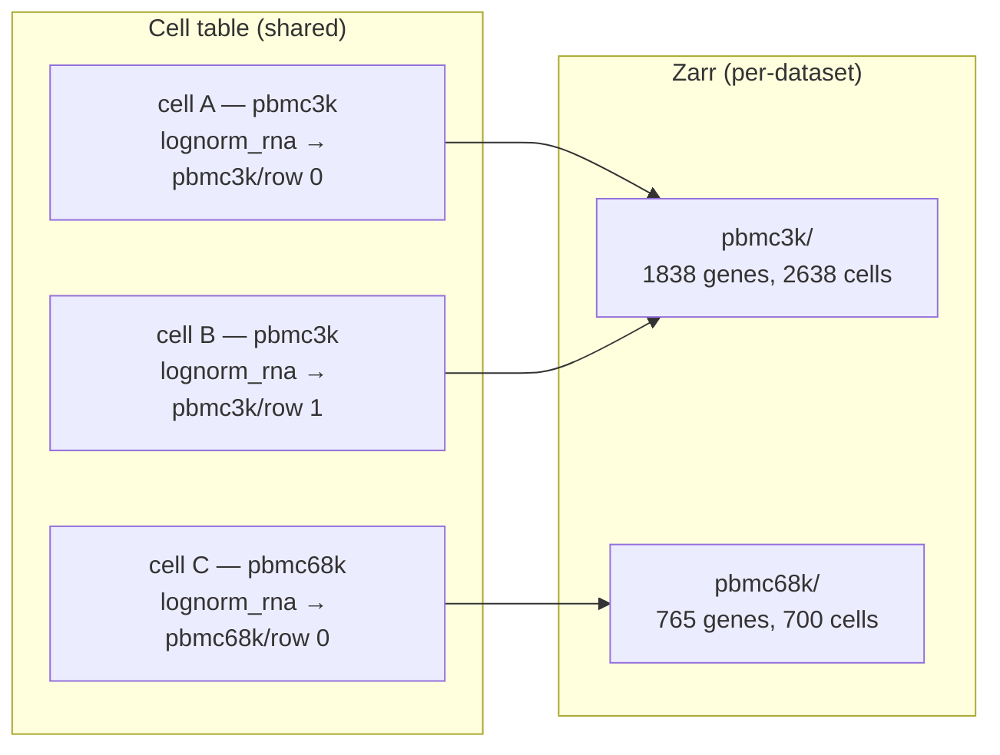
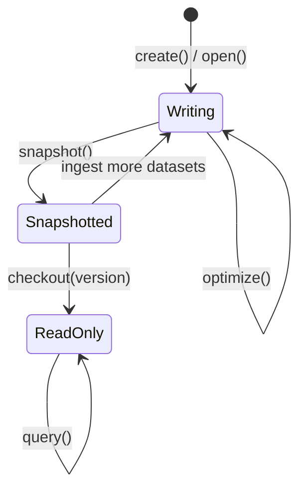

# RaggedAtlas

## What makes an atlas "ragged"

Traditional atlas tools store all cells in a single rectangular feature matrix, which means every cell must be profiled for the same set of features. In practice, datasets are collected with different assay panels, different gene sets, and different subsets of modalities. Forcing them into a shared matrix requires either intersection (discarding unique features) or imputation (filling missing values).

`RaggedAtlas` takes a different approach: the cell table is shared and flat, but each cell carries a pointer into its own zarr group. Two cells from different datasets will point to separate zarr groups with completely different feature sets — the atlas is "ragged" in the feature dimension.



At query time, the reconstruction layer joins the feature spaces across groups: it computes the union or intersection of global feature indices, scatters each group's data into the right columns, and returns a single AnnData with every cell and every feature, zero-filled where a cell's dataset didn't measure that feature.

This makes it straightforward to build an atlas from a mix of unimodal and multimodal datasets. For example, a cell that was only RNA-sequenced will have a valid `gene_expression` pointer and a null `protein_abundance` pointer. Adding a CITE-seq dataset later for new cells doesn't require changing anything, but still allows for writing queries that either join their gene expression spaces, focus on proteins, or load cells with multimodal readouts.

---

## Snapshot model: write freely, query safely

LanceDB tables and zarr object stores both support concurrent writers. Ingestion can run in parallel across many processes without coordination. Each dataset gets its own zarr group, and `merge_insert` handles concurrent feature registration without races.

However, a live (tip-of-table) view is not suitable for queries or ML training. `RaggedAtlas` solves this with an explicit snapshot model:

1. **Ingest** — write zarr arrays and cell records freely, in any order, potentially in parallel.
2. **`optimize()`** — compact Lance fragments, assign dense `global_index` values to any newly registered features, and rebuild FTS indexes.
3. **`snapshot()`** — validate consistency and record the current Lance table versions in `atlas_versions`. Returns a version number.
4. **`checkout(version)`** — open a read-only atlas pinned to a specific snapshot. Every table is pinned to the exact Lance version recorded at snapshot time, making the view fully reproducible.
5. **`query()`** — only available on a checked-out atlas. Calling it on a writable atlas raises immediately.



---

## Walkthrough

The rest of this page walks through a complete example using two PBMC datasets from scanpy. They have different feature sets (1838 vs 765 genes, 208 shared) and different obs column names — a realistic stand-in for real-world atlas ingestion.

Both datasets contain log-normalized dense expression values (highly variable genes), so we register a custom `lognorm_rna` spec rather than using the built-in sparse `gene_expression` spec.

### 1. Register a custom spec

A `ZarrGroupSpec` declares the expected zarr layout for a feature space. Registering it before defining any schema is required — the schema's pointer field names are validated against the spec registry at class definition time.

```python
from lancell.group_specs import (
    ZarrGroupSpec, PointerKind, LayersSpec, register_spec,
)
from lancell.reconstruction import DenseReconstructor

LOGNORM_RNA_SPEC = ZarrGroupSpec(
    feature_space="lognorm_rna",
    pointer_kind=PointerKind.DENSE,   # each cell stores a row index, not a byte range
    has_var_df=True,                  # this space has a feature registry + _feature_layouts rows
    layers=LayersSpec(
        uniform_shape=True,
        required=["log_normalized"],
        allowed=["log_normalized"],
    ),
    reconstructor=DenseReconstructor(),
)
register_spec(LOGNORM_RNA_SPEC)
```

### 2. Define schemas

A feature schema extends `FeatureBaseSchema` with any modality-specific fields. Here we store the gene symbol alongside the inherited `uid` and `global_index`.

```python
from lancell.schema import FeatureBaseSchema, LancellBaseSchema, DenseZarrPointer

class GeneFeature(FeatureBaseSchema):
    gene_symbol: str  # any extra fields you want queryable in the registry
```

A cell schema extends `LancellBaseSchema` and declares one pointer field per feature space the atlas will hold. The field name must exactly match the registered feature space name. In a multimodal schema, pointer fields are typed `| None` so that cells profiled in only one modality can leave the other pointers null.

```python
class CellSchema(LancellBaseSchema):
    cell_type: str | None = None     # user-defined obs metadata
    lognorm_rna: DenseZarrPointer | None = None  # must match registered feature space name
```

### 3. Create the atlas

`RaggedAtlas.create()` initialises the LanceDB tables and opens the zarr store. Pass `registry_schemas` to tell the atlas which feature spaces have a feature registry — required for any space with `has_var_df=True`.

```python
import os
import obstore.store
from lancell.atlas import RaggedAtlas
from lancell.schema import DatasetRecord

os.makedirs("/tmp/pbmc_atlas/arrays", exist_ok=True)
store = obstore.store.LocalStore("/tmp/pbmc_atlas/arrays")

atlas = RaggedAtlas.create(
    db_uri="/tmp/pbmc_atlas/db",
    cell_table_name="cells",
    cell_schema=CellSchema,
    dataset_table_name="datasets",
    dataset_schema=DatasetRecord,    # use a subclass to add provenance fields
    store=store,
    registry_schemas={"lognorm_rna": GeneFeature},  # one entry per has_var_df=True space
)
```

### 4. Load the first dataset

```python
import scanpy as sc

pbmc3k = sc.datasets.pbmc3k_processed()
# shape: (2638, 1838) — log-normalized dense float32
# obs columns: n_genes, percent_mito, n_counts, louvain
```

**Register features.** Features are registered by `uid` — a stable identifier used across registry rebuilds. Here we use the gene symbol as the uid, which is unique within this gene set. For a production atlas you would use Ensembl IDs instead.

```python
features = [
    GeneFeature(uid=gene, gene_symbol=gene)
    for gene in pbmc3k.var.index
]
atlas.register_features("lognorm_rna", features)
# register_features uses merge_insert — safe to call concurrently from multiple processes
```

`register_features` inserts new rows but does not assign `global_index`. That happens when you call `atlas.optimize()`, which assigns contiguous indices in a single-writer pass.

```python
# Assigns global_index = 0..N-1 to any features that don't have one yet,
# and runs other maintenance tasks (compaction, FTS rebuild).
atlas.optimize()
```

**Annotate var with `global_feature_uid`.** The ingestion function looks for this column to build the `_feature_layouts` feature mapping.

```python
# uid == gene symbol in this example; use Ensembl IDs in production
pbmc3k.var["global_feature_uid"] = pbmc3k.var.index
```

**Align obs to the cell schema.** `align_obs_to_schema` renames columns according to `obs_to_schema`, adds `None` for optional fields not present in obs, and drops any columns that have no corresponding schema field.

```python
from lancell.obs_alignment import align_obs_to_schema

# pbmc3k uses "louvain" for cluster/cell-type labels; our schema expects "cell_type"
pbmc3k_aligned = align_obs_to_schema(
    pbmc3k, CellSchema, obs_to_schema={"louvain": "cell_type"}
)
```

### 5. Ingest

```python
from lancell.ingestion import add_from_anndata

dataset_3k = DatasetRecord(
    zarr_group="pbmc3k",          # path within the object store
    feature_space="lognorm_rna",
    n_cells=pbmc3k.n_obs,
)

n = add_from_anndata(
    atlas,
    pbmc3k_aligned,
    feature_space="lognorm_rna",
    zarr_layer="log_normalized",  # destination layer name within the zarr group
    dataset_record=dataset_3k,
)
print(f"ingested {n} cells")  # ingested 2638 cells
```

### 6. Optimize, snapshot, and query

`optimize()` compacts Lance fragments, syncs `global_index` from the registry to `_feature_layouts`, and rebuilds the FTS indexes. Call it after bulk ingestion and before snapshotting.

```python
atlas.optimize()
v0 = atlas.snapshot()  # validates consistency, records table versions, returns version int
print(f"snapshot v{v0}")  # snapshot v0
```

`checkout_latest()` opens a read-only atlas pinned to the snapshot just created. All tables are at their Lance versions as of `v0` — any subsequent writes to the atlas will not be visible through this handle.

```python
atlas_r = RaggedAtlas.checkout_latest(
    "/tmp/pbmc_atlas/db", CellSchema, store
)
```

Queries use a fluent builder. The `where` clause accepts any LanceDB SQL predicate against the cell table columns.

```python
cd4 = (
    atlas_r.query()
    .where("cell_type = 'CD4 T cells'")  # any LanceDB SQL predicate
    .to_anndata()
)
print(cd4)
# AnnData object with n_obs × n_vars = 483 × 1838
```

```python
# Count cells grouped by cell type — only fetches the grouping column, cheap on large atlases
atlas_r.query().count(group_by="cell_type")
```

### 7. Ingest a second dataset

`pbmc68k_reduced` has 765 genes with only 208 overlapping with pbmc3k. It uses `bulk_labels` (not `louvain`) for its cell type labels — a different obs schema from the first dataset.

```python
pbmc68k = sc.datasets.pbmc68k_reduced()
# shape: (700, 765) — log-normalized dense float32
# obs columns: bulk_labels, n_genes, percent_mito, n_counts, ...
```

Register only the new features — `register_features` uses `merge_insert` and will silently skip any gene already in the registry.

```python
features_68k = [
    GeneFeature(uid=gene, gene_symbol=gene)
    for gene in pbmc68k.var.index
]
atlas.register_features("lognorm_rna", features_68k)

# 557 genes are new (765 - 208 shared); they get the next available global_index values
atlas.optimize()

pbmc68k.var["global_feature_uid"] = pbmc68k.var.index

# pbmc68k uses "bulk_labels" for cell type — map it to the same "cell_type" field
pbmc68k_aligned = align_obs_to_schema(
    pbmc68k, CellSchema, obs_to_schema={"bulk_labels": "cell_type"}
)

dataset_68k = DatasetRecord(
    zarr_group="pbmc68k",
    feature_space="lognorm_rna",
    n_cells=pbmc68k.n_obs,
)
add_from_anndata(
    atlas,
    pbmc68k_aligned,
    feature_space="lognorm_rna",
    zarr_layer="log_normalized",
    dataset_record=dataset_68k,
)
```

### 8. The atlas is now in an unsnapshotted state

The second dataset's cells and arrays are written, but no snapshot records this state. The writable atlas object (created via `create()` or `open()`) has no checked-out version, so `query()` fails immediately:

```python
atlas.query()
# RuntimeError: query() is only available on a versioned atlas.
# After ingestion, call atlas.snapshot() then
# RaggedAtlas.checkout(db_uri, version, schema, store) to pin to a
# validated snapshot. For convenience, use RaggedAtlas.checkout_latest(...).
```

The first checkout (`atlas_r`) is unaffected — it remains pinned to `v0` and only sees pbmc3k:

```python
# atlas_r is still pinned to v0; pbmc68k cells are not visible here
atlas_r.query().count()  # 2638
```

### 9. Snapshot and query the full atlas

```python
atlas.optimize()
v1 = atlas.snapshot()

# checkout_latest() always picks up the highest recorded version
atlas_r2 = RaggedAtlas.checkout_latest(
    "/tmp/pbmc_atlas/db", CellSchema, store
)

full = atlas_r2.query().to_anndata()
print(full)
# AnnData object with n_obs × n_vars = 3338 × 2395
# 3338 = 2638 (pbmc3k) + 700 (pbmc68k)
# 2395 = 1838 + 765 - 208 (union of gene sets)
```

Cells from pbmc3k have zeros for the 557 genes unique to pbmc68k, and vice versa — the reconstruction layer handles the union automatically using the `_feature_layouts` global index remap.

```python
# Restrict to features measured in every dataset (intersection)
shared = atlas_r2.query().feature_join("intersection").to_anndata()
print(shared)
# AnnData object with n_obs × n_vars = 3338 × 208
```

---

## Opening an existing atlas

Use `RaggedAtlas.open()` when you want to continue ingesting into an atlas that was created in a previous session. This gives you a live writable handle — the same handle you'd get from `create()`. For read-only access, use `checkout_latest()` directly.

```python
atlas = RaggedAtlas.open(
    db_uri="/tmp/pbmc_atlas/db",
    cell_table_name="cells",
    cell_schema=CellSchema,
    dataset_table_name="datasets",
    store=store,
    # maps feature space name -> LanceDB table name (default: "{space}_registry")
    registry_tables={"lognorm_rna": "lognorm_rna_registry"},
)
```

To inspect available snapshots before checking out:

```python
RaggedAtlas.list_versions("/tmp/pbmc_atlas/db")
# shape: (2, 9) — one row per snapshot, columns include version, total_cells, created_at
```
