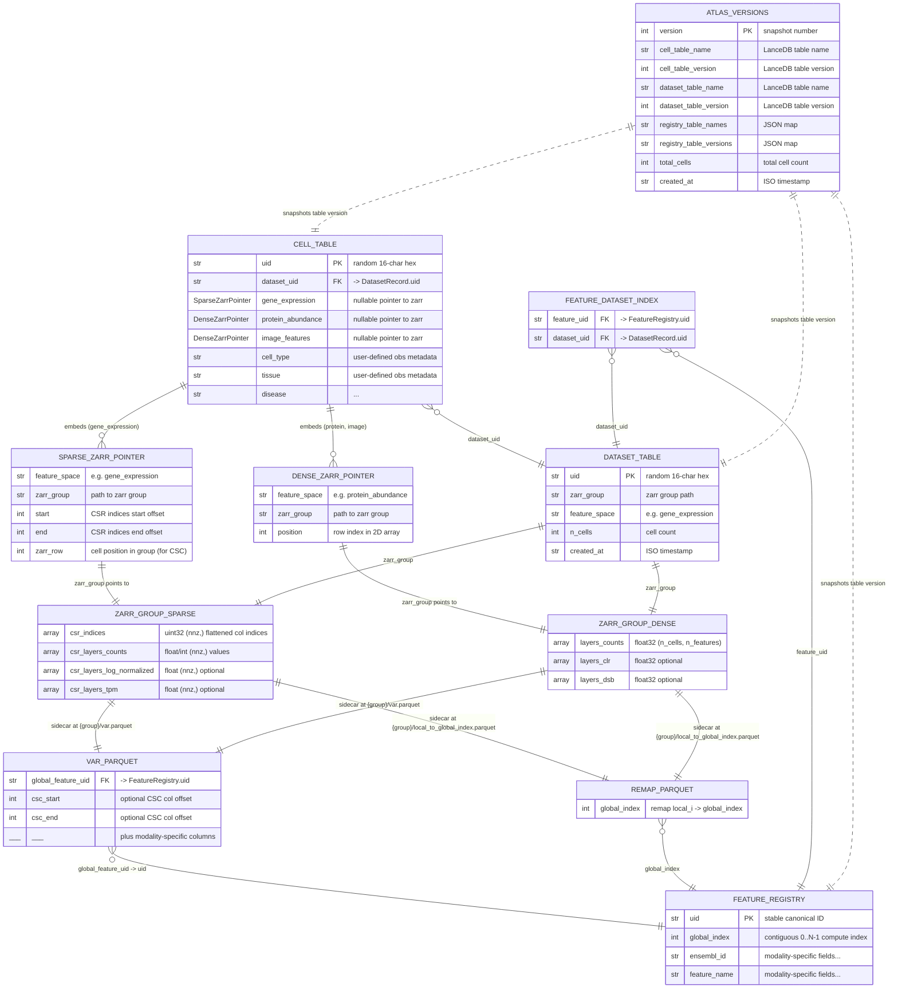
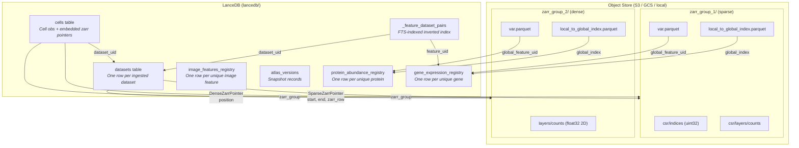

# Lancell Data Model

## Overview

Lancell uses a hybrid storage architecture:
- **LanceDB** for queryable metadata tables (cells, datasets, feature registries, versions)
- **Zarr** for bulk numerical arrays (gene expression, protein abundance, etc.)
- **Parquet** sidecars alongside zarr groups for per-dataset feature metadata and index remaps

---

## Entity Relationship Diagram

## Storage Backends

## Feature Spaces

| Feature Space | Pointer Type | Zarr Layout | Required Layers | Optional Layers |
|---|---|---|---|---|
| `gene_expression` | `SparseZarrPointer` | `csr/indices` (1D uint32) + `csr/layers/*` (1D, same shape) | `counts` | `log_normalized`, `tpm` |
| `protein_abundance` | `DenseZarrPointer` | `layers/*` (2D float32, uniform shape) | `counts` | `clr`, `dsb`, `log_normalized` |
| `image_features` | `DenseZarrPointer` | `layers/*` (2D float32, uniform shape) | `raw` | `log_normalized`, `ctrl_standardized` |

## Key Design Properties

- **Indptr is not stored** -- CSR row boundaries are reconstructed from each cell's `(start, end)` in the pointer
- **Feature indices are local per zarr group** -- the `local_to_global_index.parquet` remap translates local feature index `i` to the global contiguous index in the feature registry
- **Remap freshness** -- the zarr group stores `remap_registry_version` in attrs; stale remaps are rebuilt on read
- **One feature registry per feature space** -- `global_index` values are reassigned by `reindex_registry()` (deterministic sort by `uid`)
- **Versioning** -- `AtlasVersionRecord` snapshots LanceDB table versions for time-travel/checkout
