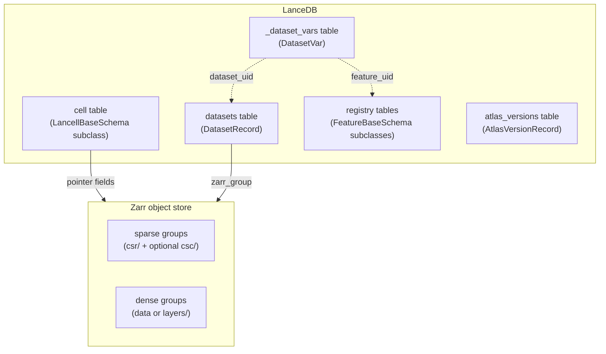
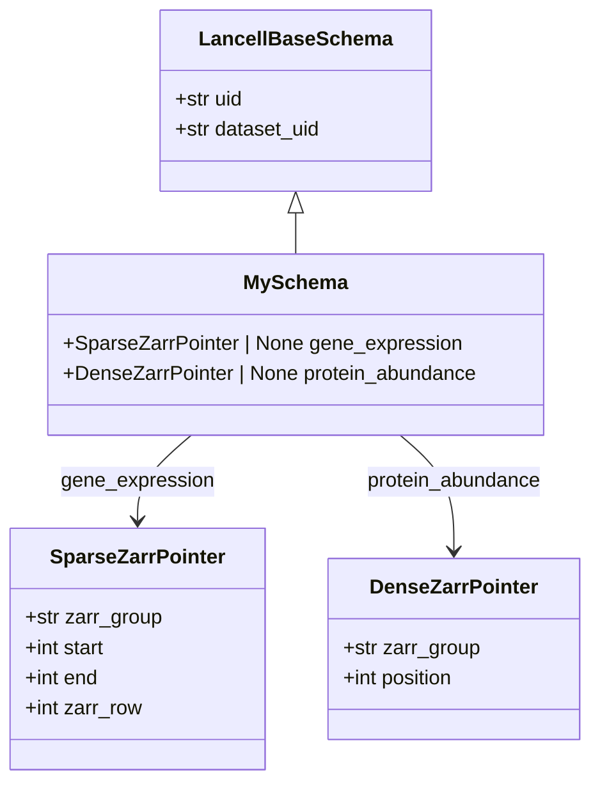
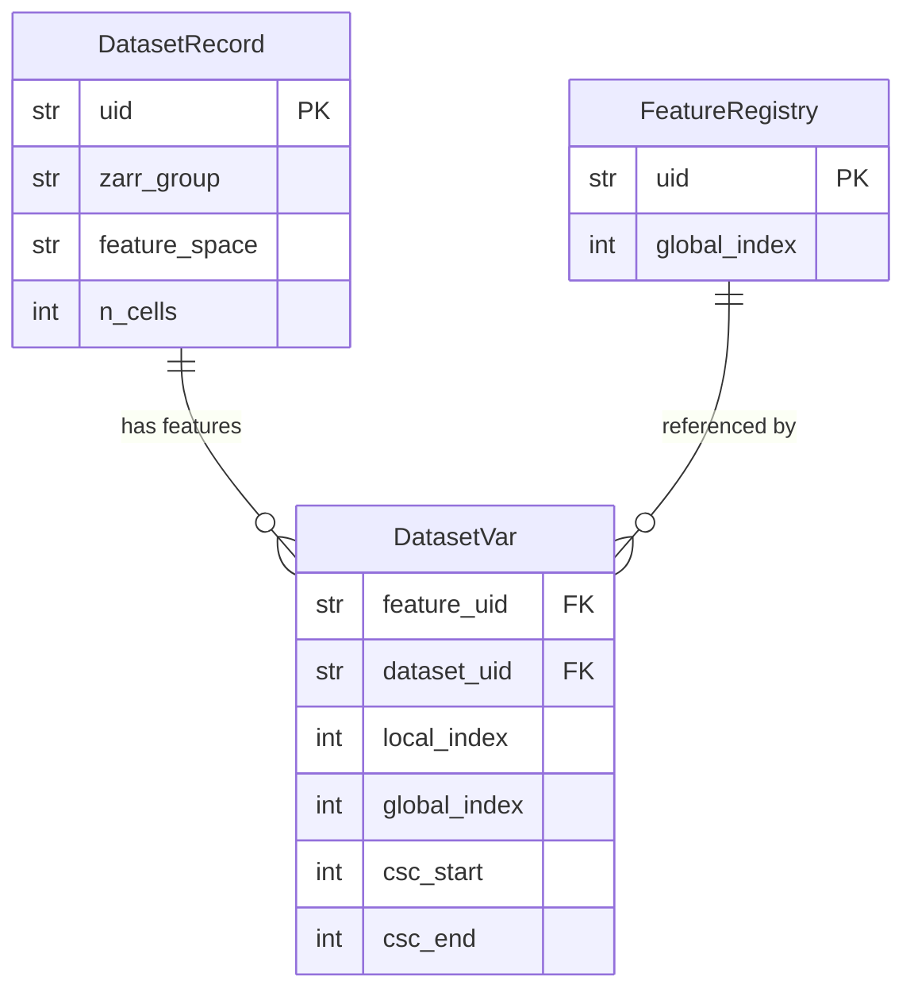
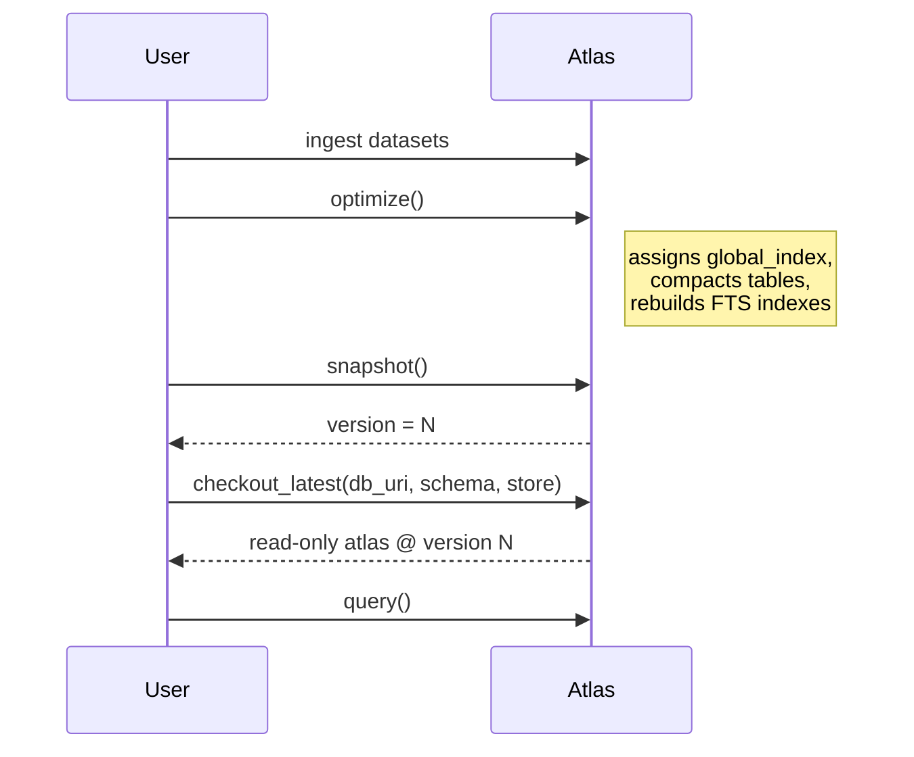

# Data Structure

A `RaggedAtlas` is backed by two co-located stores:

- **LanceDB database** — all tabular data: cell metadata, feature registries, dataset inventory, and the per-dataset feature mapping
- **Zarr object store** — all array data: count matrices, embeddings, image tiles

No manifest files or external sidecars need to be maintained outside the atlas.

## Overall layout



---

## Cell table: `LancellBaseSchema`

Each row in the cell table is one observation — a cell, nucleus, spatial tile, etc. The exact schema is user-defined by subclassing `LancellBaseSchema`.

Every cell row carries:

| Field | Type | Description |
|---|---|---|
| `uid` | `str` | Random 16-char hex. Unique per cell; safe for concurrent writes. |
| `dataset_uid` | `str` | Links back to the originating `DatasetRecord`. |
| _pointer fields_ | `SparseZarrPointer \| DenseZarrPointer \| None` | One column per feature space the cell may have been profiled in. |

Pointer field names must match a registered feature space name (enforced at class definition time). At least one pointer field must be declared.

### Pointer types

**`SparseZarrPointer`** — used for high-dimensional sparse assays (gene expression, chromatin peaks):

| Field | Description |
|---|---|
| `zarr_group` | Path to the zarr group within the object store |
| `start` / `end` | Element positions into `csr/indices` (derived from the CSR `indptr`). Slice `[start:end]` gives this cell's non-zero entries. |
| `zarr_row` | 0-indexed row in the group; used for column-oriented (CSC) reads |

**`DenseZarrPointer`** — used for dense assays (protein abundance, image embeddings):

| Field | Description |
|---|---|
| `zarr_group` | Path to the zarr group |
| `position` | Row index into the group's dense array |

A typical multimodal schema looks like:

```python
class MySchema(LancellBaseSchema):
    gene_expression: SparseZarrPointer | None = None
    protein_abundance: DenseZarrPointer | None = None
```



---

## Zarr group layouts

Each ingested dataset occupies one zarr group. The internal layout depends on the feature space's `PointerKind`.

### Sparse groups

Used for gene expression, chromatin peaks, and other high-dimensional sparse assays. Data is stored in coordinate order — appending a new dataset is a pure array append.

```
<zarr_group>/
└── csr/
    ├── indices          # (N_entries,)  uint32 — local feature indices
    └── layers/
        └── counts       # (N_entries,)  dtype  — values
```

`indices` holds **local** column indices (0-based within this dataset's feature ordering). The mapping from local to global feature index is stored in `_dataset_vars.global_index` and used at read time for scatter/gather operations.

A cell's data is at `csr/indices[start:end]` (and the matching slice from each layer), where `start`/`end` come from the cell's `SparseZarrPointer`.

After calling `add_csc()`, a column-sorted counterpart is written alongside CSR. This enables efficient feature-filtered queries (reading a feature across many cells) without scanning all cells:

```
<zarr_group>/
├── csr/
│   ├── indices          # row-sorted: entry order matches cell order
│   └── layers/
│       └── counts
└── csc/
    ├── indices          # col-sorted: entry order matches feature order (cell row ids)
    └── layers/
        └── counts
```

### Dense groups

Used for protein abundance, image feature vectors, and other low-dimensional dense assays. Dense groups write a 2-D array with shape `(N_cells, N_features)`. Depending on whether a layer name was specified at ingest time, the array lives either directly at `data` or under a `layers/` subgroup:

```
<zarr_group>/
└── data                 # (N_cells, N_features)  float32
```

or:

```
<zarr_group>/
└── layers/
    └── <layer_name>     # (N_cells, N_features)  float32
```

A cell is located at row index `position` from the cell's `DenseZarrPointer`.

---

## Datasets table

Every ingested zarr group is registered as a `DatasetRecord`:

| Field | Description |
|---|---|
| `uid` | Stable dataset identifier |
| `zarr_group` | Path to the zarr group (matches pointer fields in cell table) |
| `feature_space` | Which feature space this group belongs to |
| `n_cells` | Number of cells in this dataset |
| `created_at` | UTC ISO timestamp |

The datasets table is the authoritative inventory of what zarr groups exist. `validate()` uses it to enumerate groups for consistency checks.

---

## `_dataset_vars` table

`_dataset_vars` is an inverted index bridging datasets and features. Each `DatasetVar` row records one (feature, dataset) pair:

| Field | Description |
|---|---|
| `feature_uid` | `global_feature_uid` from the registry. FTS-indexed for feature → datasets lookup. |
| `dataset_uid` | `DatasetRecord.uid`. FTS-indexed for dataset → features lookup. |
| `local_index` | 0-based position of this feature in the dataset's zarr array (i.e. the column index stored in `csr/indices`). |
| `global_index` | Denormalized from the registry. Used as a scatter/gather key at training time — no database lookup needed in the hot path. |
| `csc_start` / `csc_end` | Element range for this feature's column in `csc/indices`. Populated by `add_csc()`; null until then. |

FTS indices on both `feature_uid` and `dataset_uid` make two queries efficient:

- **Feature → datasets**: which datasets measured feature X? (`find_datasets_with_features`)
- **Dataset → features**: given a dataset, reconstruct the `local → global` index remap for vectorized scatter/gather



---

## Feature registries

Each feature space with a stable feature axis maintains a LanceDB registry table. All schemas subclass `FeatureBaseSchema`:

| Field | Description |
|---|---|
| `uid` | Stable canonical identifier. Never reassigned. Use for durable references across atlas rebuilds. |
| `global_index` | Dense integer (0 .. N-1) assigned by `reindex_registry()`. Used as an array index in compute paths. Never reassigned once set — new features get `max + 1`. |

Modality-specific subclasses add fields like gene symbol, Ensembl ID, UniProt ID, SMILES, guide sequence, etc.

The `uid` / `global_index` split separates two concerns: `uid` is safe for concurrent writers (no coordination needed); `global_index` is assigned in a single-writer reindexing pass so it always forms a contiguous range suitable for array indexing and scatter/gather operations.

---

## Versioning

`snapshot()` records a consistent point-in-time view across all Lance table versions as an `AtlasVersionRecord`. `checkout(version)` (or `checkout_latest()`) reopens every table pinned to the exact Lance version captured in that record — giving a reproducible, read-only view of the atlas state. `query()` is only available on a checked-out atlas.


