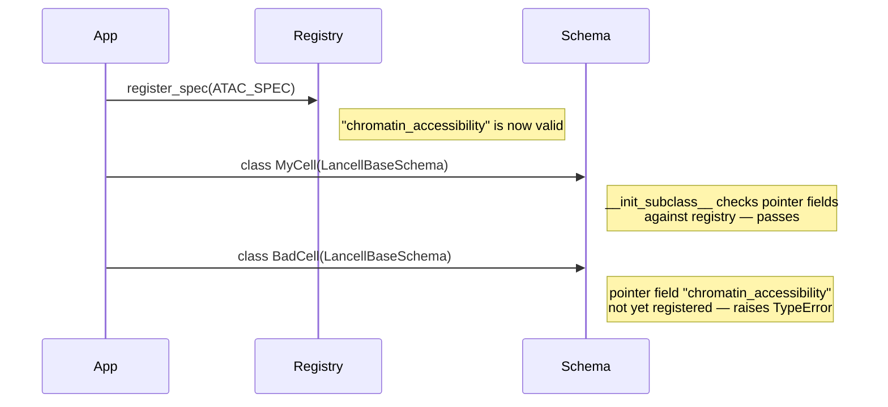

# Zarr Group Specs

A `ZarrGroupSpec` is a declaration: it tells lancell what zarr arrays to expect inside a group, which pointer kind to use, and how to reconstruct data at query time. Every feature space in the atlas must have a registered spec. Specs are validated at class-definition time — a `LancellBaseSchema` subclass that references a feature space without a registered spec will raise immediately.

```python
from lancell.group_specs import (
    ZarrGroupSpec, PointerKind, SubgroupSpec, ArraySpec,
    DTypeKind, register_spec, get_spec, registered_feature_spaces,
)
from lancell.reconstruction import SparseCSRReconstructor, DenseReconstructor, FeatureCSCReconstructor
```

---

## Core concepts

### PointerKind

`PointerKind` is a string enum with two values:

| Value | Pointer type on cell rows | Typical use |
|---|---|---|
| `SPARSE` | `SparseZarrPointer` | High-dimensional sparse assays: gene expression, chromatin accessibility |
| `DENSE` | `DenseZarrPointer` | Low-dimensional dense assays: protein panels, image embeddings |

The `PointerKind` declared in the spec must match the pointer field types used in your `LancellBaseSchema` subclass. Constructing a `SparseZarrPointer` against a `DENSE` spec (or vice versa) raises a `ValueError` immediately.

### ArraySpec

`ArraySpec` declares expected properties of a single zarr array:

| Field | Type | Description |
|---|---|---|
| `array_name` | `str` | Path of the array relative to the group root (e.g. `"csr/indices"`). |
| `dtype_kind` | `DTypeKind \| None` | Expected numeric category: `BOOL`, `SIGNED_INTEGER`, `UNSIGNED_INTEGER`, or `FLOAT`. `None` means any dtype is accepted. |
| `ndim` | `int \| None` | Expected number of dimensions. `None` means any dimensionality is accepted. |

### SubgroupSpec

`SubgroupSpec` declares expected properties of a zarr subgroup:

| Field | Type | Description |
|---|---|---|
| `subgroup_name` | `str` | Path of the subgroup relative to the group root (e.g. `"csr/layers"`). |
| `required_arrays` | `list[ArraySpec] \| None` | Specific named arrays that must exist in this subgroup. |
| `uniform_shape` | `bool` | When `True`, all arrays in this subgroup must share the same shape. Useful for asserting that all layers have identical cell and feature counts. |
| `match_shape_of` | `str \| None` | When set, every array in this subgroup must have the same shape as the sibling array named here (resolved relative to the parent group). |

---

## `ZarrGroupSpec` fields

`ZarrGroupSpec` is the top-level registration object. Each field controls a different aspect of how lancell interacts with a feature space.

### `feature_space`

A string that must be unique across the spec registry. This value is used as the pointer field name in `LancellBaseSchema` subclasses and as the key for the feature registry table (when `has_var_df=True`). Choosing a stable, descriptive name matters: renaming a registered space after cells have been ingested requires migrating pointer field values in the cell table.

### `pointer_kind`

`PointerKind.SPARSE` or `PointerKind.DENSE`. Determines whether cells in this space carry `SparseZarrPointer` or `DenseZarrPointer` fields, and what zarr layout the ingestion layer writes.

### `reconstructor`

A `Reconstructor` protocol instance. Controls how data is assembled back into an AnnData at query time. The three built-in options are:

- `SparseCSRReconstructor()` — for sparse assays stored in CSR layout. Reads byte ranges from `csr/indices` and the corresponding layer array, then scatter-gathers into the global feature space.
- `DenseReconstructor()` — for dense assays. Reads row slices from a dense 2-D array and scatters into the global feature space.
- `FeatureCSCReconstructor()` — for feature-filtered queries on sparse data. Requires that `add_csc()` has been called on the group; reads from `csc/indices` instead of `csr/indices`, enabling efficient column extraction without touching all cell rows.

See the Reconstructors page for guidance on choosing between these.

### `has_var_df`

`bool`. When `True`, this feature space has a feature registry table and entries in the `_feature_layouts` table (see [Feature Layouts](feature_layouts.md)). The registry table schema must be supplied to `RaggedAtlas.create()` via `registry_schemas`. Set to `False` for spaces with no stable feature axis — for example, arbitrary-length embedding vectors where the column count varies by dataset and no cross-dataset feature identity is meaningful.

### `required_arrays`

`list[ArraySpec]`. Arrays that must exist directly under the group root. The `validate_group` method checks that each named array is present and (if specified) has the right `dtype_kind` and `ndim`. Missing or mistyped arrays are reported as errors.

### `required_subgroups`

`list[SubgroupSpec]`. Subgroups that must exist under the group root. Each `SubgroupSpec` can further declare required arrays, shape uniformity, and shape matching constraints against sibling arrays.

### `required_layers`

`list[str]`. Layer names that the reconstruction layer loads by default at query time. These names are resolved against the `layers/` subgroup (or `csr/layers/` for sparse groups) when assembling an AnnData. Every name in `required_layers` must also appear in `allowed_layers`.

### `allowed_layers`

`list[str]`. Whitelist of valid layer names for ingestion validation. Attempting to ingest a layer whose name is not in this list raises an error. Use this to prevent subtle naming inconsistencies from accumulating across datasets (e.g., `"lognorm"` vs `"log_normalized"` vs `"log_norm"`).

---

## Built-in specs

Two specs are pre-registered in `lancell.builtins`. They are imported automatically when `lancell.builtins` is imported, which happens at package init.

### `GENE_EXPRESSION_SPEC`

```python
ZarrGroupSpec(
    feature_space="gene_expression",
    pointer_kind=PointerKind.SPARSE,
    has_var_df=True,
    required_arrays=[ArraySpec(array_name="csr/indices", ndim=1, dtype_kind=DTypeKind.UNSIGNED_INTEGER)],
    required_subgroups=[SubgroupSpec(subgroup_name="csr/layers", uniform_shape=True, match_shape_of="csr/indices")],
    required_layers=["counts"],
    allowed_layers=["counts", "log_normalized", "tpm"],
    reconstructor=SparseCSRReconstructor(),
)
```

The `match_shape_of="csr/indices"` constraint on the layers subgroup ensures that every layer array has the same number of entries as the indices array — a prerequisite for correct CSR reads. The `uniform_shape=True` constraint ensures that all layers within the subgroup have matching shapes with each other, preventing partial ingestion where one layer has more entries than another.

### `IMAGE_FEATURES_SPEC`

```python
ZarrGroupSpec(
    feature_space="image_features",
    pointer_kind=PointerKind.DENSE,
    has_var_df=True,
    required_subgroups=[SubgroupSpec(subgroup_name="layers", uniform_shape=True)],
    required_layers=["raw"],
    allowed_layers=["raw", "log_normalized", "ctrl_standardized"],
    reconstructor=DenseReconstructor(),
)
```

No `required_arrays` at the root because dense groups place everything under `layers/`. The `uniform_shape=True` on the layers subgroup enforces that all layer arrays share the same `(N_cells, N_features)` shape.

---

## Defining a custom spec

Custom specs are the primary extension point. The pattern is: construct a `ZarrGroupSpec`, call `register_spec()`, then define any `LancellBaseSchema` subclass that uses it.

**`register_spec()` must be called before any `LancellBaseSchema` subclass that references the feature space is defined.** The pointer field validation happens at class-definition time, not at instantiation time.

### Dense custom spec

This example registers a `lognorm_rna` space for dense log-normalized RNA-seq data — the same spec used in the atlas walkthrough.

```python
from lancell.group_specs import (
    ZarrGroupSpec, PointerKind, SubgroupSpec, register_spec,
)
from lancell.reconstruction import DenseReconstructor

LOGNORM_RNA_SPEC = ZarrGroupSpec(
    feature_space="lognorm_rna",
    pointer_kind=PointerKind.DENSE,
    has_var_df=True,
    required_subgroups=[SubgroupSpec(subgroup_name="layers", uniform_shape=True)],
    required_layers=["log_normalized"],
    allowed_layers=["log_normalized"],
    reconstructor=DenseReconstructor(),
)
register_spec(LOGNORM_RNA_SPEC)
```

After this call, `"lognorm_rna"` is a valid pointer field name for any `LancellBaseSchema` subclass defined in the same process.

### Sparse custom spec

For sparse data such as chromatin accessibility, mirror the structure of `GENE_EXPRESSION_SPEC`:

```python
from lancell.group_specs import ArraySpec, DTypeKind
from lancell.reconstruction import SparseCSRReconstructor

ATAC_SPEC = ZarrGroupSpec(
    feature_space="chromatin_accessibility",
    pointer_kind=PointerKind.SPARSE,
    has_var_df=True,
    required_arrays=[ArraySpec(array_name="csr/indices", ndim=1, dtype_kind=DTypeKind.UNSIGNED_INTEGER)],
    required_subgroups=[SubgroupSpec(subgroup_name="csr/layers", uniform_shape=True, match_shape_of="csr/indices")],
    required_layers=["counts"],
    allowed_layers=["counts"],
    reconstructor=SparseCSRReconstructor(),
)
register_spec(ATAC_SPEC)
```

### Ordering requirements



If `register_spec()` is called after the schema class is defined, the `TypeError` from the schema definition will have already propagated. The fix is always to move `register_spec()` earlier in the module load order, typically in a dedicated `specs.py` module that is imported before any schema module.

---

## Querying the registry

Two utility functions inspect the live registry:

```python
from lancell.group_specs import get_spec, registered_feature_spaces

registered_feature_spaces()
# {'gene_expression', 'image_features', 'lognorm_rna', 'chromatin_accessibility', ...}

spec = get_spec("gene_expression")
# ZarrGroupSpec(feature_space='gene_expression', pointer_kind=<PointerKind.SPARSE: 'sparse'>, ...)
```

`get_spec()` raises `KeyError` if the named space is not registered. Use `registered_feature_spaces()` to check membership before calling `get_spec()` in code that handles unknown spaces.

---

## Group validation

`ZarrGroupSpec.validate_group(group)` returns a list of error strings — empty if the group satisfies all constraints declared by the spec. This is called internally by `atlas.validate()` but can also be used during development to verify a group before ingestion.

```python
import zarr

group = zarr.open_group("/path/to/group")
errors = spec.validate_group(group)
if errors:
    for e in errors:
        print(e)
```

Typical errors include missing arrays, wrong `ndim`, wrong `dtype_kind`, a missing subgroup, arrays within a subgroup with mismatched shapes, and a layer array whose shape does not match the required sibling array. Validation does not load any array data — it only inspects zarr metadata, so it is fast even for large remote groups.
