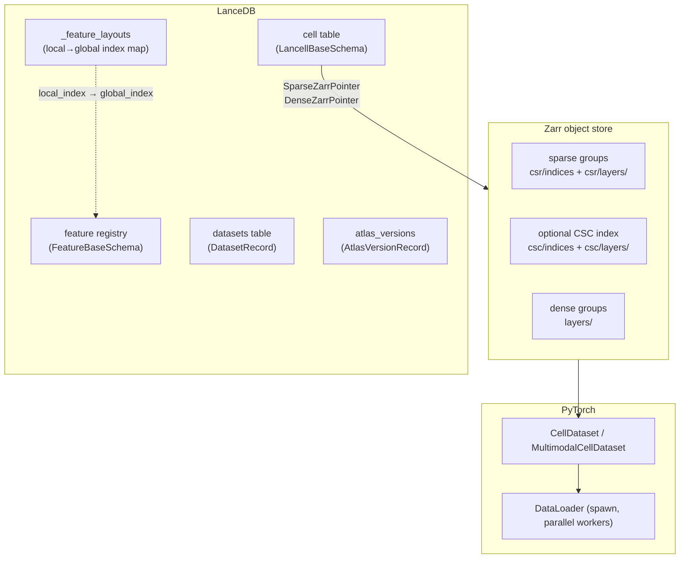

# lancell

Lancell is a multimodal single-cell database built for interactive analysis and ML training at scale. It stores cell metadata in [LanceDB](https://lancedb.com) and raw array data (count matrices, images and features) in [Zarr](https://zarr.dev), and provides a PyTorch-native data loading layer that reads directly from those stores without intermediate copies or format conversions.

A central design goal is to make it practical to train foundation models on collections of heterogeneous datasets — datasets with different gene panels, different assayed modalities, and different obs schemas — without forcing them into a common rectangular matrix upfront.

---

## Why lancell

### Ragged feature spaces, unified cell table

Real-world atlas building involves stitching together datasets that were not designed to be compatible. A 10x 3' dataset measures ~33,000 genes. A targeted panel measures 500. A CITE-seq experiment adds protein on top of RNA. Conventional tools handle this by padding to a union matrix (wasteful) or intersecting to shared features (lossy).

Lancell takes a different approach: each dataset occupies its own zarr group with its own feature ordering, and each cell carries a pointer into its group. The reconstruction layer handles union/intersection/feature-filter logic at query time — no padding is stored, no information is discarded at ingest.

### Querying across cells, modalities, and feature spaces

The cell table lives in LanceDB, so the full query surface is available without writing custom loaders: SQL predicates, vector similarity search (ANN), full-text search, and multi-column aggregations all work out of the box. You can count cell types, find nearest neighbors by embedding, filter by metadata, and load the result as AnnData or MuData in a single fluent chain.

```python
# Filter by metadata, load gene expression as AnnData
adata = atlas_r.query().where("tissue = 'lung' AND cell_type IS NOT NULL").to_anndata()

# Retrieve the 50 cells most similar to a query embedding
hits = atlas_r.query().search(query_vec, vector_column_name="embedding").limit(50).to_anndata()

# Load only a specific gene panel — uses the CSC index when available for minimal I/O
adata = atlas_r.query().features(["CD3D", "CD19", "MS4A1"], "gene_expression").to_anndata()
```

Feature-filtered queries are a first-class operation. When you request a gene panel, lancell uses the optional CSC (column-sorted) index to read only the byte ranges belonging to those features — O(nnz for wanted features) instead of O(nnz across all cells). Groups without a CSC index fall back to CSR reads automatically, so the index is purely additive and can be built incrementally.

For multimodal atlases, `.to_mudata()` returns one `AnnData` per modality wrapped in `MuData`, with per-cell presence masks tracking which cells were measured by each assay. `.to_batches()` provides a streaming iterator for queries that would exceed memory if materialised all at once.

### Fast reads from cloud storage

Zarr's sharded storage format packs many chunks into a single object-store file. The shard index records each chunk's byte offset, enabling targeted range reads — but the Python zarr stack issues one HTTP request per chunk even when chunks can be coalesced.

Lancell includes a Rust extension (`RustShardReader`) that handles shard reads manually: it batches all requested ranges, issues one `get_ranges` call per shard file (coalescing multiple chunks into as few network requests as possible), and decodes chunks in parallel using rayon. On remote object stores (S3, GCS, Azure), this typically cuts latency-dominated read time by an order of magnitude compared to sequential per-chunk fetches. The same reader backs both interactive queries and ML training — fast cloud reads are not a special mode, they are the default.

### BP-128 bitpacking

When ingesting integer count data (`int32`, `int64`, `uint32`, `uint64`), lancell automatically applies BP-128 bitpacking with delta encoding to the sparse `indices` array, and BP-128 without delta to the values array. BP-128 is a SIMD-accelerated codec that packs integers using the minimum number of bits required per 128-element block.

In practice this delivers compression ratios comparable to the zarr default zstd on typical single-cell count matrices, while decoding at memory bandwidth speeds — making it strictly better than general-purpose codecs for this data type. 

### Map-style PyTorch datasets

Lancell's `CellDataset` and `MultimodalCellDataset` are map-style PyTorch datasets that expose a `__getitem__` interface. This means PyTorch's `DataLoader` can dispatch any index to any worker process independently.

### Versioned snapshots

Lancell separates the writable ingest path from the read/query path with an explicit snapshot model. You ingest freely, call `snapshot()` to record a consistent point-in-time view across all LanceDB table versions, then `checkout(version)` to open a read-only handle pinned to that snapshot. Queries and training runs execute against a frozen, reproducible view of the atlas — concurrent ingestion into the live atlas does not affect them.

---

## Architecture overview



---

## Installation

Prebuilt wheels are available on PyPI. Requires Python 3.13.

```bash
pip install lancell          # core: atlas, querying, ingestion
pip install lancell[ml]      # + PyTorch dataloader
pip install lancell[bio]     # + scanpy, bionty, GEOparse
pip install lancell[io]      # + S3/GCS/Azure, image codecs
pip install lancell[viz]     # + marimo, matplotlib
pip install lancell[all]     # everything
```

To build from source (requires a Rust toolchain):

```bash
curl -LsSf https://astral.sh/uv/install.sh | sh
curl --proto '=https' --tlsv1.2 -sSf https://sh.rustup.rs | sh
uv sync
maturin develop --release
```

---

## Documentation

### Concepts

- **[Data Structure](data_structure.md)** — the LanceDB + zarr layout, pointer types, `_feature_layouts` feature mapping, and versioning model.
- **[Building an Atlas](atlas.md)** — end-to-end walkthrough: register a spec, define schemas, ingest two datasets with different feature panels, snapshot, and run union/intersection queries.

### Reference

- **[Schemas](schemas.md)** — all LanceDB schema classes: `LancellBaseSchema`, `SparseZarrPointer`, `DenseZarrPointer`, `FeatureBaseSchema`, `DatasetRecord`, `FeatureLayout`, `AtlasVersionRecord`. Covers the `uid`/`global_index` split and how pointer fields are validated.
- **[Feature Layouts](feature_layouts.md)** — Python API for the `_feature_layouts` table: computing layout UIDs, building layout DataFrames, reindexing the registry, syncing global indices, and resolving feature UIDs to global positions.
- **[Group Specs](group_specs.md)** — `ZarrGroupSpec`, `PointerKind`, `ArraySpec`, `LayersSpec`, built-in specs, and how to define custom specs for new assay types.
- **[Querying](querying.md)** — the `AtlasQuery` fluent builder: filtering cells, controlling feature reconstruction, union/intersection joins, feature-filtered queries, and all terminal methods (`.to_anndata()`, `.to_mudata()`, `.to_batches()`, `.count()`).
- **[Reconstructors](reconstructors.md)** — `SparseCSRReconstructor`, `DenseReconstructor`, `FeatureCSCReconstructor`; choosing between them; the `Reconstructor` protocol for custom implementations.
- **[Array Storage](array_storage.md)** — `add_from_anndata` internals: streaming from backed `.h5ad` files, chunk/shard sizing, BP-128 bitpacking, the `_feature_layouts` feature mapping. Building the optional CSC column index with `add_csc()` for fast feature-filtered reads.
- **[PyTorch Data Loading](dataloader.md)** — `CellDataset` and `MultimodalCellDataset`; `CellSampler` (locality-aware bin-packing); collate functions; `make_loader` with spawn parallelism.

---

## Quickstart

```python
import obstore.store
from lancell.atlas import RaggedAtlas
from lancell.schema import LancellBaseSchema, FeatureBaseSchema, SparseZarrPointer
from lancell.ingestion import add_from_anndata

# lancell registers built-in specs (gene_expression, image_features) at import time —
# no register_spec() call needed for these feature spaces.

# 1. Define schemas
class GeneFeature(FeatureBaseSchema):
    gene_symbol: str

class CellSchema(LancellBaseSchema):
    cell_type: str | None = None
    gene_expression: SparseZarrPointer | None = None  # matches built-in feature space name

# 2. Create atlas
store = obstore.store.LocalStore("/data/atlas/arrays")
atlas = RaggedAtlas.create(
    db_uri="/data/atlas/db",
    cell_table_name="cells",
    cell_schema=CellSchema,
    store=store,
    registry_schemas={"gene_expression": GeneFeature},
)

# 3. Register features and ingest
atlas.register_features("gene_expression", features)
add_from_anndata(atlas, adata, feature_space="gene_expression",
                 zarr_layer="counts", dataset_record=record)

# 4. Snapshot and query
# optimize() assigns global_index to any newly registered features internally
atlas.optimize()
atlas.snapshot()

atlas_r = RaggedAtlas.checkout_latest("/data/atlas/db", CellSchema, store)
adata = atlas_r.query().where("cell_type = 'T cells'").to_anndata()
```

For a full walkthrough with two heterogeneous datasets, see [Building an Atlas](atlas.md).
