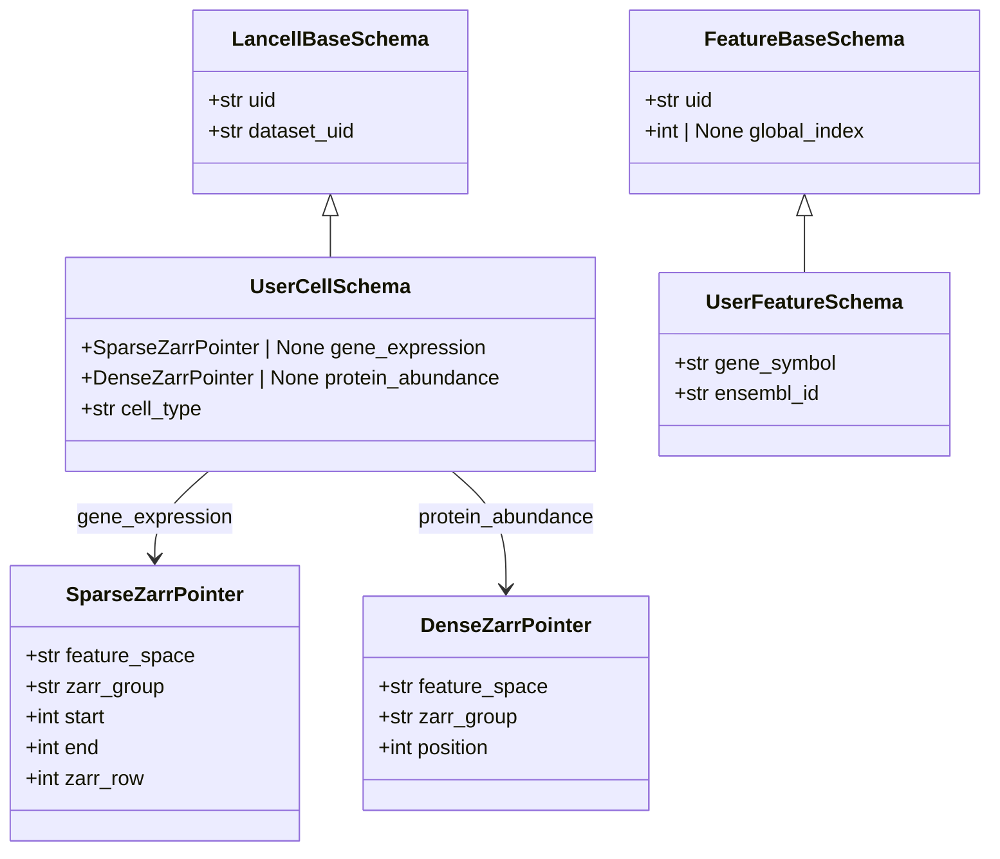

# Schemas

Every table in a lancell atlas is backed by a Pydantic schema class that subclasses LanceDB's `LanceModel`. These schemas are the ground-level contracts between your application code and the database: they define what columns each table has, what types those columns hold, and which fields are optional or auto-populated.

There are two distinct families:

- **Cell schemas** — subclasses of `LancellBaseSchema`. One table per atlas; rows represent individual cells (or nuclei, spatial tiles, etc.).
- **Feature schemas** — subclasses of `FeatureBaseSchema`. One table per feature space; rows represent features (genes, proteins, peaks, etc.) that have a stable identity across datasets.

Beyond those two user-extensible families, lancell maintains several internal tables — `DatasetRecord`, `DatasetVar`, and `AtlasVersionRecord` — that you interact with indirectly during ingestion and versioning. All are described below.

```python
from lancell.schema import (
    LancellBaseSchema, FeatureBaseSchema,
    SparseZarrPointer, DenseZarrPointer,
    DatasetRecord, DatasetVar, AtlasVersionRecord,
)
```

---

## Inheritance hierarchy



---

## Pointer types

Pointer types are nested structs stored directly inside each cell row. They link a cell to the precise location of its data in the zarr object store.

### `SparseZarrPointer`

Used for high-dimensional sparse assays — gene expression, chromatin peak counts, and anything else stored in CSR layout.

| Field | Type | Description |
|---|---|---|
| `feature_space` | `str` | Name of the registered feature space this pointer belongs to. |
| `zarr_group` | `str` | Path to the zarr group within the object store. Matches the `zarr_group` field on the corresponding `DatasetRecord`. |
| `start` | `int` | Start position into `csr/indices` (inclusive). Derived from the CSR `indptr` at ingest time. |
| `end` | `int` | End position into `csr/indices` (exclusive). The slice `[start:end]` spans all non-zero entries for this cell. |
| `zarr_row` | `int` | 0-indexed row of this cell within the dataset's zarr group. Used as the lookup key for column-oriented (CSC) reads. |

`start` and `end` are element positions into the flat `csr/indices` and `csr/layers/*` arrays — not byte offsets. The values come from the zarr group's `indptr` array during ingestion: `start = indptr[row]`, `end = indptr[row + 1]`.

`SparseZarrPointer` validates at construction time that the named `feature_space` is registered with `PointerKind.SPARSE`. Assigning a sparse pointer to a dense feature space raises a `ValueError` immediately.

### `DenseZarrPointer`

Used for dense assays — protein abundance vectors, image feature embeddings, image tiles, and any other measurement that stores one row per cell in a 2-D array.

| Field | Type | Description |
|---|---|---|
| `feature_space` | `str` | Name of the registered feature space. |
| `zarr_group` | `str` | Path to the zarr group within the object store. |
| `position` | `int` | Row index of this cell in the dense 2-D array (`N_cells × N_features`). |

Like `SparseZarrPointer`, this validates that `feature_space` is registered with `PointerKind.DENSE`.

### Choosing between sparse and dense

Use `SparseZarrPointer` when most cells have zero values for most features — the overhead of storing indices pays off as soon as sparsity exceeds roughly 80-90%. Gene expression and chromatin accessibility are almost always sparse.

Use `DenseZarrPointer` when the measurement is inherently dense: every cell has a value for every feature, or the feature count is small enough that storing zeros is cheaper than the index overhead. Protein panels (dozens of features) and image embeddings (fixed-dimension vectors) are typical dense cases.

The choice is fixed at feature-space registration time via `PointerKind` in the `ZarrGroupSpec`. Pointer field types on your cell schema must match.

---

## `LancellBaseSchema`

`LancellBaseSchema` is the base class for the cell table. Every cell in your atlas is one row of a table whose schema is a subclass of this class.

### Auto-populated fields

| Field | Type | Description |
|---|---|---|
| `uid` | `str` | 16-character random hex string, generated by `uuid4().hex[:16]`. Unique per cell. Safe for concurrent writers because no coordination is needed to generate it. |
| `dataset_uid` | `str` | Filled automatically by the ingestion layer to match the `uid` of the `DatasetRecord` the cell was ingested with. Do not set this manually. |

Both `uid` and `dataset_uid` are defined on the base class and should not be redeclared in subclasses.

### Pointer fields

Pointer fields are the only required additions when subclassing. Each pointer field declares that cells in this atlas may have been measured in the corresponding feature space.

The field name must exactly match a feature space name registered via `register_spec()`. This is checked at class-definition time inside `__init_subclass__`: if a pointer field is declared before its feature space has been registered, a `TypeError` is raised immediately, not at runtime.

Type annotations for pointer fields follow a fixed pattern:

```python
field_name: SparseZarrPointer | None = None   # for sparse feature spaces
field_name: DenseZarrPointer | None = None    # for dense feature spaces
```

The `| None` and `= None` are both required. A cell that was not profiled in a given modality leaves that pointer null; the reconstruction layer treats null pointers as absent data and zero-fills accordingly.

Two invariants are enforced:

1. **At class definition time**: at least one pointer field must be declared. A subclass with no pointer fields raises a `TypeError` immediately.
2. **At instance creation time**: at least one pointer field must be non-null. A cell row with all null pointers raises a `ValueError` from the model validator.

### Multimodal example

```python
from lancell.schema import LancellBaseSchema, SparseZarrPointer, DenseZarrPointer

class MultimodalCellSchema(LancellBaseSchema):
    # Pointer fields — names must match registered feature spaces
    gene_expression: SparseZarrPointer | None = None
    chromatin_accessibility: SparseZarrPointer | None = None
    protein_abundance: DenseZarrPointer | None = None
    image_features: DenseZarrPointer | None = None

    # Arbitrary obs metadata — any LanceDB-compatible types
    cell_type: str | None = None
    tissue: str | None = None
    disease: str | None = None
    donor_id: str | None = None
    assay: str | None = None
```

A cell from a CITE-seq experiment might populate `gene_expression` and `protein_abundance` while leaving `chromatin_accessibility` and `image_features` null. A cell from a single-nucleus ATAC-seq dataset would populate only `chromatin_accessibility`. Both are valid rows in the same table.

### Unimodal example

```python
from lancell.schema import LancellBaseSchema, SparseZarrPointer

class CensusCell(LancellBaseSchema):
    gene_expression: SparseZarrPointer | None = None

    cell_type: str | None = None
    tissue: str | None = None
    assay: str | None = None
    self_reported_ethnicity: str | None = None
    development_stage: str | None = None
    sex: str | None = None
    is_primary_data: bool | None = None
```

For a unimodal atlas, a single pointer field is sufficient. The `| None` is still required so that pointer validation is enforced via the model validator rather than silently accepting null rows.

---

## `FeatureBaseSchema`

`FeatureBaseSchema` is the base class for feature registry tables. Each feature space that has a stable feature axis (genes, proteins, peaks, image feature channels, etc.) maintains its own registry table whose schema subclasses this class.

### Fields

| Field | Type | Description |
|---|---|---|
| `uid` | `str` | Stable canonical identifier for the feature. Generated by default as a 16-char hex uid, but you should supply a domain-meaningful value (Ensembl gene ID, UniProt accession, etc.) when a canonical identifier exists. Never reassigned once written. |
| `global_index` | `int \| None` | Dense integer position in the range `0..N-1`, assigned by `reindex_registry()`. Starts as `None`; remains `None` until the first reindexing pass. |

### The `uid` / `global_index` split

These two fields serve different roles and are intentionally managed separately.

`uid` is the durable, cross-rebuild identifier. Multiple concurrent ingestion processes can register new features simultaneously via `register_features()` without coordination, because generating a `uid` requires no knowledge of what other processes are doing. It is safe to use `uid` in application code, foreign-key relationships, and any reference that must survive an atlas rebuild.

`global_index` is the array-indexing key. It must be a contiguous integer range `0..N-1` so it can be used directly as a scatter/gather key during reconstruction — no hash lookup or sort is needed at training time. Assigning contiguous integers in a concurrent-write scenario would require coordination, so it is done in a single dedicated step: `reindex_registry()` scans the registry once, assigns `global_index` to any feature that does not yet have one (new features get `max(existing_global_index) + 1`), and writes back. Call this after all `register_features()` calls for a batch and before ingestion begins.

Never use `global_index` as a persistent reference outside the atlas. It is stable once assigned (a feature's index does not change when new features are added), but the contiguous range assumption means that rebuilding the registry from scratch would produce different values.

### Subclassing

Add any modality-specific fields as ordinary Pydantic fields:

```python
from lancell.schema import FeatureBaseSchema

class GeneFeature(FeatureBaseSchema):
    gene_symbol: str
    ensembl_id: str
    feature_biotype: str   # e.g. "protein_coding", "lncRNA"
    feature_length: int
```

```python
class ProteinFeature(FeatureBaseSchema):
    uniprot_id: str
    protein_name: str
    gene_name: str | None = None
    organism: str
```

```python
class ChromatinPeak(FeatureBaseSchema):
    chrom: str
    start: int
    end: int
    peak_type: str | None = None   # e.g. "promoter", "enhancer"
```

The `uid` field carries the canonical identifier for the modality. For genes, use Ensembl gene IDs. For proteins, use UniProt accessions. For peaks, use a stable coordinate string like `chr1:100000-100500`. Consistent `uid` values across atlas builds allow the registry to be extended without losing continuity.

---

## `DatasetRecord`

`DatasetRecord` is the dataset inventory table. One row is written per zarr group ingested into the atlas.

| Field | Type | Description |
|---|---|---|
| `uid` | `str` | Auto-generated 16-char hex identifier. Used as `dataset_uid` on every cell row ingested from this group. |
| `zarr_group` | `str` | Path to the zarr group within the object store. This is the same path stored in pointer fields on cell rows, so the two can be joined. |
| `feature_space` | `str` | The registered feature space name for this group (e.g. `"gene_expression"`, `"protein_abundance"`). |
| `n_cells` | `int` | Number of cells in the dataset. Recorded at ingest time; used by `validate()` when checking consistency between the cell table and the zarr arrays. |
| `created_at` | `str` | UTC ISO 8601 timestamp, set automatically at instantiation. |

You construct a `DatasetRecord` explicitly when calling `add_from_anndata()` or the lower-level ingestion functions. If you need to attach provenance fields (source database accession, DOI, release date, etc.), subclass `DatasetRecord` and pass your subclass to `RaggedAtlas.create()` as the `dataset_schema` argument:

```python
from lancell.schema import DatasetRecord

class CensusDatasetRecord(DatasetRecord):
    cellxgene_dataset_id: str
    census_release_date: str
```

`validate()` uses the datasets table to enumerate all expected zarr groups and check that their cell counts match the cell table.

---

## `DatasetVar`

`DatasetVar` is the inverted index that bridges the datasets table and the feature registries. One row is written per (feature, dataset) pair at ingestion time.

| Field | Type | Description |
|---|---|---|
| `feature_uid` | `str` | The `uid` from the feature registry. FTS-indexed for feature → datasets lookup. |
| `dataset_uid` | `str` | The `uid` from `DatasetRecord`. FTS-indexed for dataset → features lookup. |
| `local_index` | `int` | 0-based position of this feature in the dataset's zarr array (i.e. the column index stored in `csr/indices`). Used as the sort key when building the local→global remap for a dataset. |
| `global_index` | `int` | Denormalized copy of the feature's `global_index` from the registry. Written by `optimize()` after `reindex_registry()` has run. Used as the scatter/gather key in the reconstruction hot path — no database lookup needed during training. |
| `csc_start` | `int \| None` | Start position into `csc/indices` for this feature's column. Populated by `add_csc()`; null until then. |
| `csc_end` | `int \| None` | End position into `csc/indices` for this feature's column. Populated by `add_csc()`; null until then. |

The `_dataset_vars` table supports two query directions efficiently via FTS indexes on both `feature_uid` and `dataset_uid`:

- **Feature → datasets**: given a feature `uid`, which datasets measured it? This drives queries like `find_datasets_with_features`.
- **Dataset → features**: given a `dataset_uid`, reconstruct the full `local_index → global_index` remap array for vectorized scatter/gather during batch assembly.

`DatasetVar` rows are written by the ingestion layer and updated by `optimize()`. You will rarely construct or query them directly — they are an internal implementation detail of the reconstruction and sampling pipeline.

---

## `AtlasVersionRecord`

`AtlasVersionRecord` captures a consistent snapshot of every Lance table version in the atlas. One row is written each time `snapshot()` is called.

| Field | Type | Description |
|---|---|---|
| `version` | `int` | Monotonically increasing snapshot number. Returned by `snapshot()`. |
| `cell_table_name` | `str` | Name of the LanceDB cell table at snapshot time. |
| `cell_table_version` | `int` | Lance internal version number for the cell table. |
| `dataset_table_name` | `str` | Name of the datasets table. |
| `dataset_table_version` | `int` | Lance internal version number for the datasets table. |
| `registry_table_names` | `str` | JSON object mapping feature space name to registry table name, e.g. `{"gene_expression": "gene_expression_registry"}`. |
| `registry_table_versions` | `str` | JSON object mapping feature space name to the Lance version integer for that table. |
| `dataset_vars_table_version` | `int` | Lance internal version for the `_dataset_vars` table. |
| `total_cells` | `int` | Total cell count across all datasets at snapshot time. Written for quick inspection without opening the cell table. |
| `created_at` | `str` | UTC ISO 8601 timestamp. |

`checkout(version)` reads the corresponding `AtlasVersionRecord` and reopens every table pinned to the exact Lance version captured there. This makes any checked-out atlas fully reproducible: subsequent writes to the underlying tables do not affect the checked-out view.

`registry_table_names` and `registry_table_versions` are stored as JSON strings rather than structured columns because the set of registered feature spaces is user-defined and varies between atlas configurations. The `checkout` implementation deserializes these with `json.loads` and iterates over the pairs.

You do not construct `AtlasVersionRecord` instances directly. They are created by `snapshot()` and read by `checkout()` and `list_versions()`.
